# vscode 에서 환경 설정하기 

## 플러그인 깔기 

기본적 으로 gradle 을 빌더로 세팅 하기로 한다.

### Java Extension Pack(Micosoft)
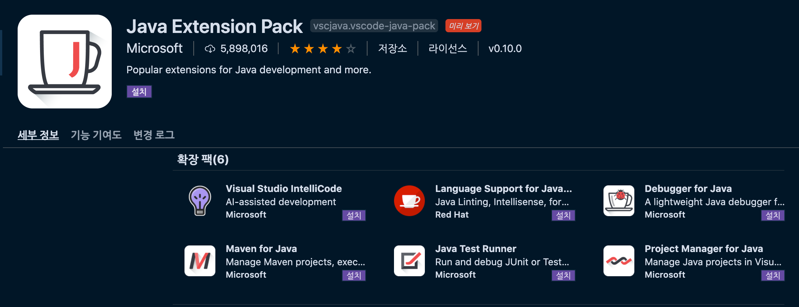


  - java언어 지원 기능, 디버거, 테스트 실행, maven 프로젝트 관리 등의 확장을 패키징 한 패키지


### Spring Boot Extension Pack(Pivotal)
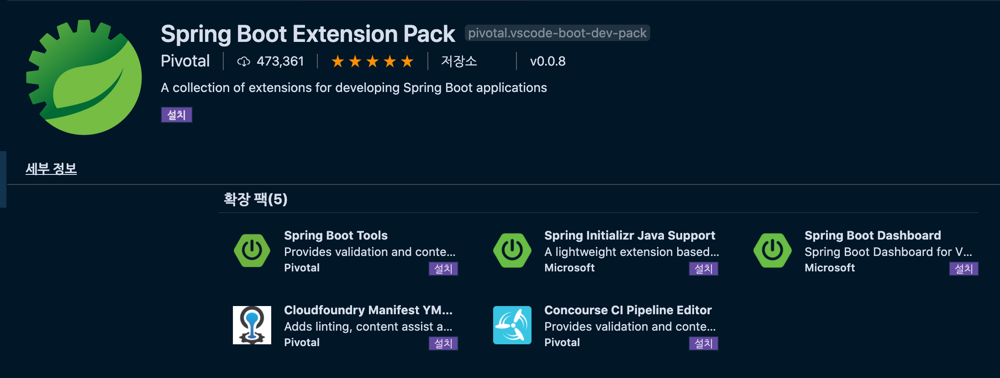

  - spring 프레임워크에 적용할 수 있는 유용한 기능이 들어있는 패키지, Spring Initializr 가 포함되어 있다.

### lombok 
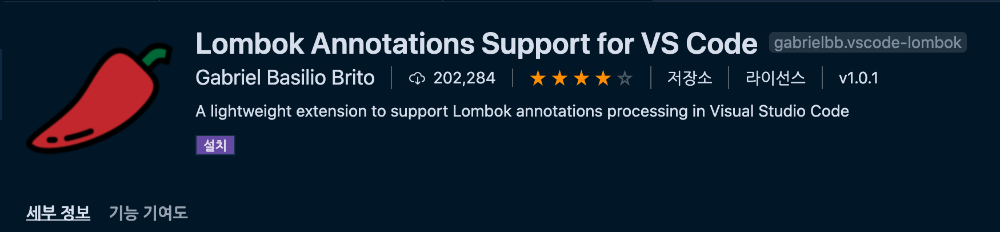

  - 롬복 애노테이션 플러그인
  

### Gradle Extension Pack
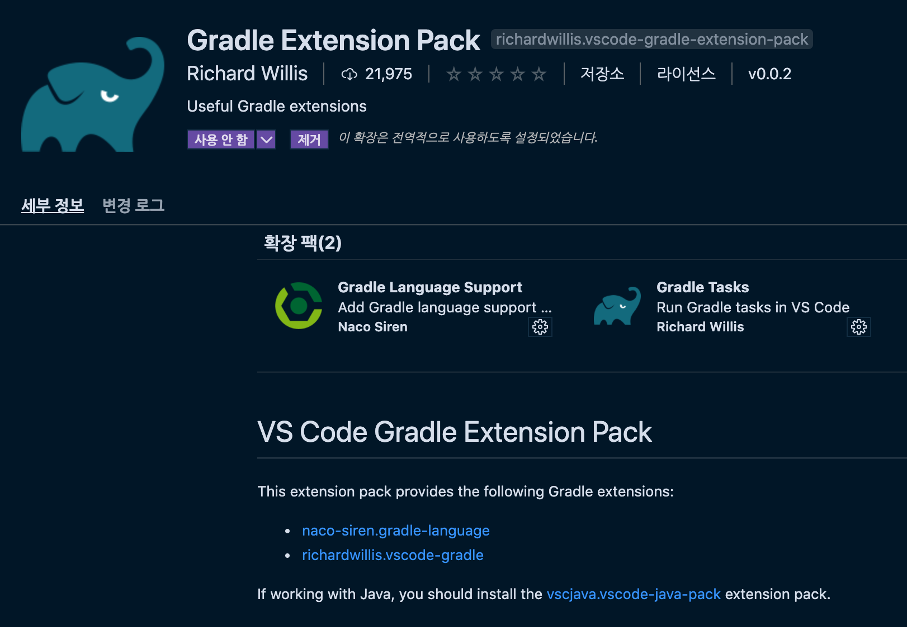
<!--  -->


 - Gradle 관련 팩 Gradle 설치후 까는것을 추천, 설치하고 나면 Gradle 아이콘이 vs code 에 생기는데 만약 안생긴다면 설정 > gradle 검색 아래 설정을 true 로 변경 한다.


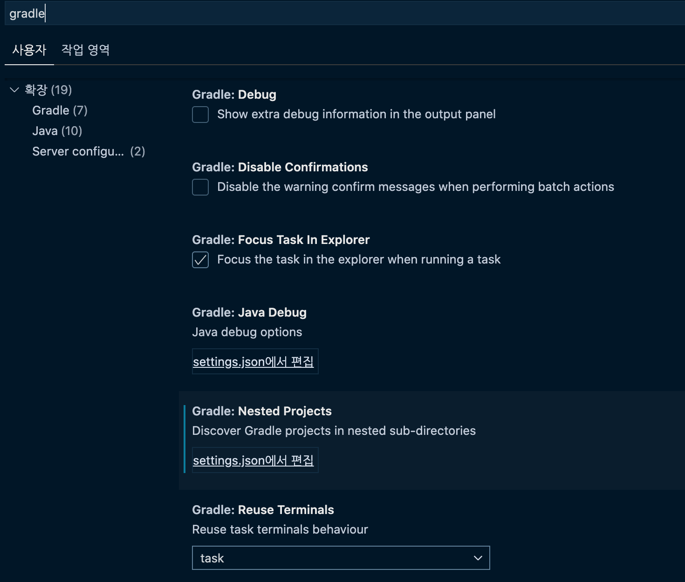


 ```json
 "gradle.nestedProjects": true
 ```


### 자바 위치 설정하기 

설정에서 jdk 를 검색한다. 

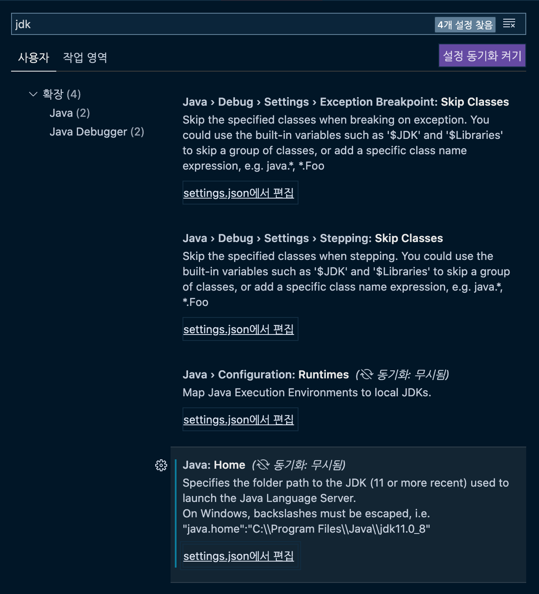

```json
// "java.home": "/usr/libexec/java_home"
"java.home": "/Library/Java/JavaVirtualMachines/adoptopenjdk-8.jdk/Contents/Home"
```

### 프로젝트 생성하기
CMD + Shift + P 누르면 실행 창이 열린다. 여기서 spring 를 검색하면 스트링부트 템플릿 설정 할수 있는 명령이 보이게 된다. 

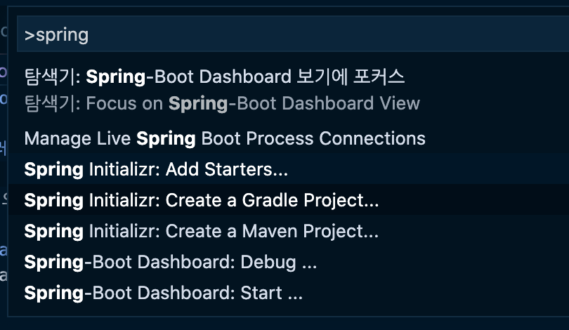

[Spring Initializr](https://start.spring.io/) 프로젝트를 가져다 사용하기에 똑같은 방식으로 기본 프로젝트를 웹에서도 자동으로 생성할수 있다. 옵션은 다음과 같다. 

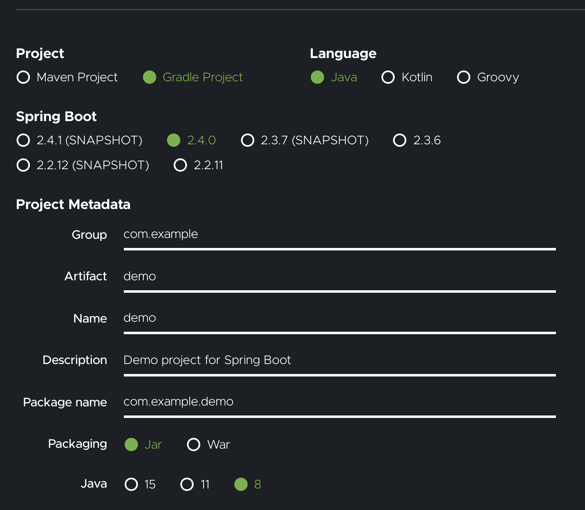

여기서는 Spring Initializr: Create a Gradle Project 를 선택하자 

터미널 창에서도 똑같은 것을 물어 오기때문에 따로 적지는 않는다. 정 급하면 웹에서 생성해도 되기 때문이다. 

스프링 부트에서 중요한 Dependencies 설정이다. 처음이니까 사용할 저정도만 설정 했다. 

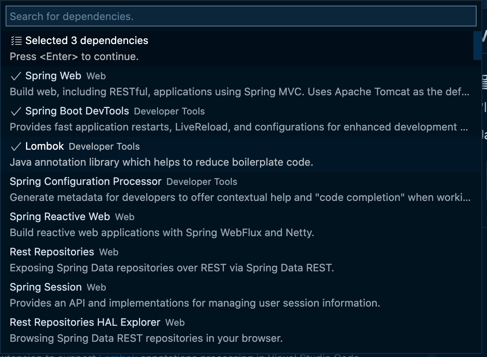

이제 빌드를 해서 성공하면 된다. 

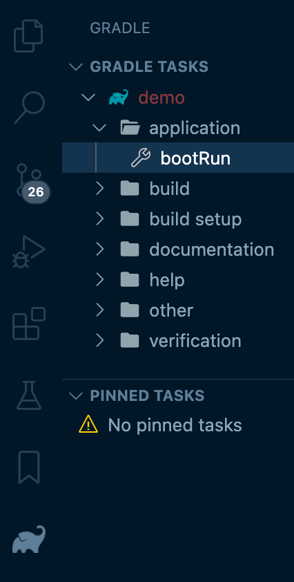

### 빌드시 에러 

`Java 11 or more recent is required to run the Java extension. Please download and install a recent JDK. You can still compile your projects with older JDKs by configuring 'java.configuration.runtimes'`

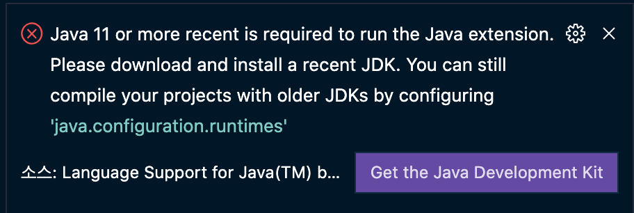

이 에러가 나서 뭔가 하고 찾아 보았다. 스프링 디펜던시 중에서 JAVA 11을 사용하는데 내가 8을 깔았기 때문에 자바 버전 관련된 에러 였다. 상세 설치 경로를 설정해 줘야 한다는것을 알았다.

[vscode java.configuration.runtimes 설정](https://code.visualstudio.com/docs/java/java-project) 을 보면 다음과 같이 설정 하라고 한다. 

setting.json 에서 Java 쪽에 다음과 같은 옵션을 누르고 수정하면 다음과 같이 넣을수 있다. 

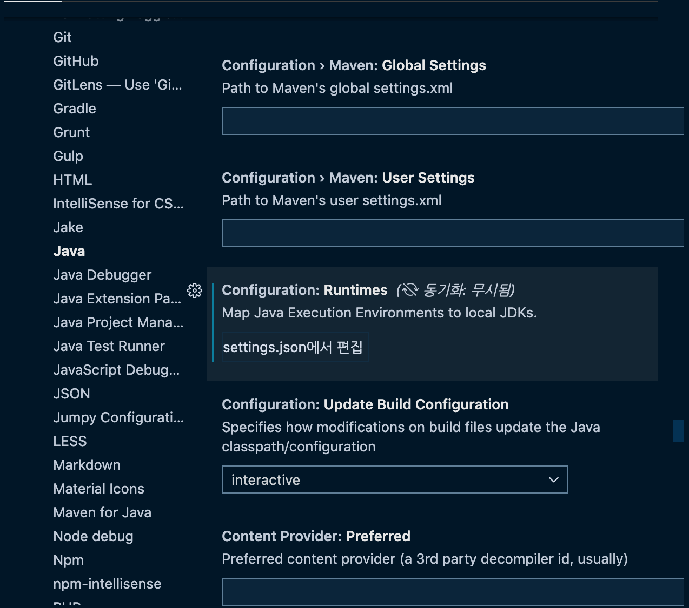

```json
"java.configuration.runtimes": [
  {
    "name": "JavaSE-1.8",
    "path": "/usr/local/jdk1.8.0_201"
  },
  {
    "name": "JavaSE-11",
    "path": "/usr/local/jdk-11.0.3",
    "sources" : "/usr/local/jdk-11.0.3/lib/src.zip",
    "javadoc" : "https://docs.oracle.com/en/java/javase/11/docs/api",
    "default":  true
   },
   {
    "name": "JavaSE-12",
    "path": "/usr/local/jdk-12.0.2"
   },
   {
    "name": "JavaSE-13",
    "path": "/usr/local/jdk-13"
   }
]
```

현재 기준으로 작성 가능한 name 이름은 다음과 같다. 

`
"J2SE-1.5", 
"JavaSE-1.6", 
"JavaSE-1.7", 
"JavaSE-1.8", 
"JavaSE-9", 
"JavaSE-10", 
"JavaSE-11", 
"JavaSE-12", 
"JavaSE-13", 
"JavaSE-14"
`

그래서 찾아보니 jdk11 버전을 그냥 설치하는게 나은것 같아서 [adoptopenjdk](https://adoptopenjdk.net/) 에서 받아서 설치 했다. 그리고 java.configuration.runtimes 설정 

```json
 "java.home": "/Library/Java/JavaVirtualMachines/adoptopenjdk-8.jdk/Contents/Home",
    "java.jdt.ls.vmargs": "-XX:+UseParallelGC -XX:GCTimeRatio=4 -XX:AdaptiveSizePolicyWeight=90 -Dsun.zip.disableMemoryMapping=true -Xmx1G -Xms100m -javaagent:\"/Users/hanlee/.vscode/extensions/gabrielbb.vscode-lombok-1.0.1/server/lombok.jar\"",
    "gradle.nestedProjects": true,
    "java.configuration.runtimes": [
        {
            "name": "JavaSE-11",
            "path": "/Library/Java/JavaVirtualMachines/adoptopenjdk-11.jdk/Contents/Home",
            // "default":  true
        }
    ]
```

그래도 에러 떠서 ..... 설정을 바꾸었다. 

```json
 // "java.home": "/Library/Java/JavaVirtualMachines/adoptopenjdk-8.jdk/Contents/Home",
    "java.jdt.ls.vmargs": "-XX:+UseParallelGC -XX:GCTimeRatio=4 -XX:AdaptiveSizePolicyWeight=90 -Dsun.zip.disableMemoryMapping=true -Xmx1G -Xms100m -javaagent:\"/Users/hanlee/.vscode/extensions/gabrielbb.vscode-lombok-1.0.1/server/lombok.jar\"",
    "gradle.nestedProjects": true,
    "java.configuration.runtimes": [
        {
            "name": "JavaSE-1.8",
            "path": "/Library/Java/JavaVirtualMachines/adoptopenjdk-8.jdk/Contents/Home",
        },
        {
            "name": "JavaSE-11",
            "path": "/Library/Java/JavaVirtualMachines/adoptopenjdk-11.jdk/Contents/Home",
            "default":  true
        }
    ],
    "java.project.importOnFirstTimeStartup": "automatic"
```

변경하고 나니 에러가 없다. 즉 java11 을 기본으로 설정 해야만 문제가 없다.

#### 관련 링크들 
[vscode-java-debug](https://github.com/microsoft/vscode-java-debug/issues/852), [vscode-java java.configuration.runtimes](https://github.com/redhat-developer/vscode-java/wiki/JDK-Requirements#java.configuration.runtimes)


### 롬복 설치
 - [vscode lombok](https://planbsw.tistory.com/109?category=811149)
 - [vscode 설정](https://gethlemn.tistory.com/28?category=1111786)